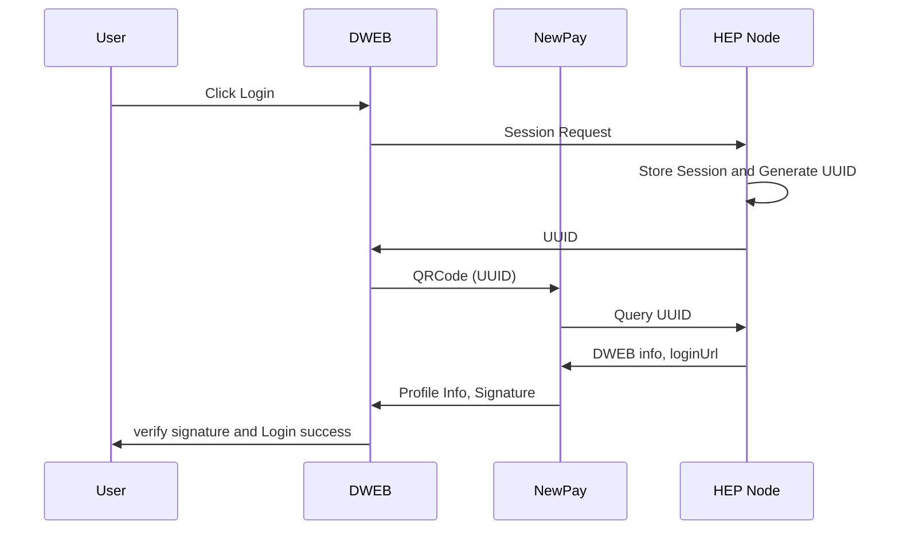
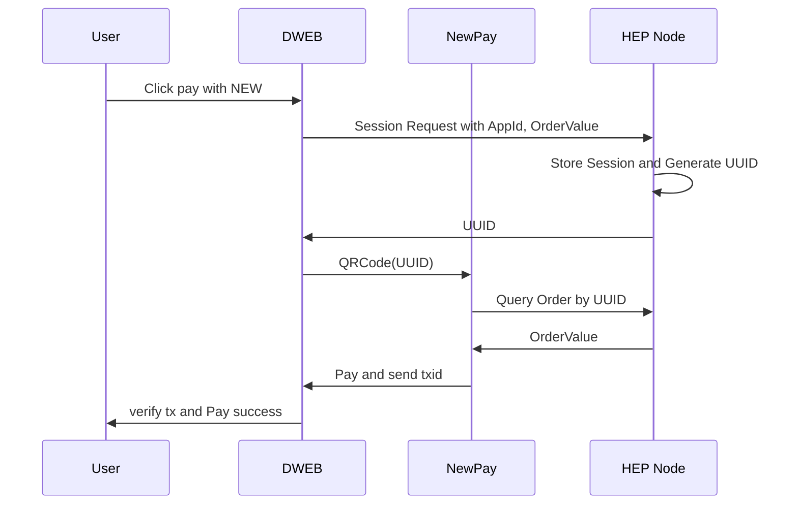
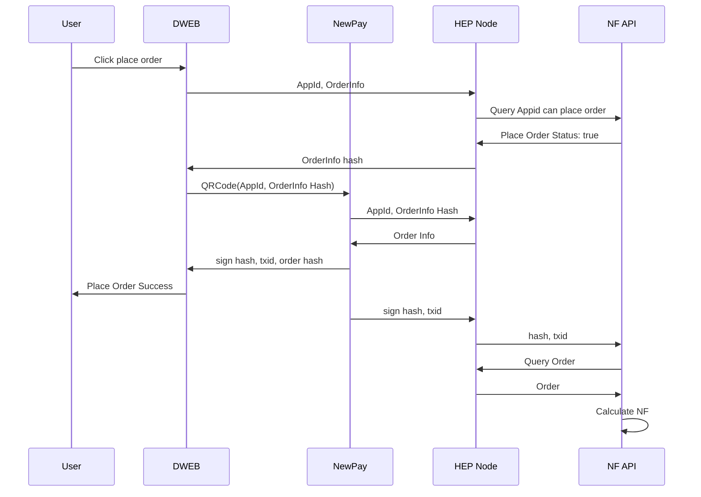

# Decentralized Web

The HEP SDK provides a Javascript API for websites to integrate with NewID for user login and payments

## User Account Creation and Login

### Preconditions

* User has NewPay installed on their device and has set a NewID
* The Dapp or website requesting login has [registered on Newton's platform]

### Website requests user login

1. Website displays *Login with NewID* button
2. User clicks or taps button
3. Website sends session request to [HEP Node]
4. [HEP Node] stores session information and sends [UUID] back to website
5. If on mobile, user is redirected to NewPay bringing [UUID]. Otherwise, website pops up a QR code for user to scan, containing [UUID]

* See [newpay.web.login.requestAccess]

### User authorizes website on NewPay

1. NewPay gets [UUID] from QR code or schema url
2. NewPay sends [UUID] to [HEP Node]
3. [HEP Node] uses [UUID] to query session information and website information that was registered in database
4. [HEP Node] sends information back to NewPay
5. NewPay opens and prompts user to authorize the website login based on information gathered from [HEP Node]
6. User confirms login
7. User sends login request to website, including NewID, personal information, [message] and [signature]

## Payments

### Website requests user payment

1. Website displays *Pay with NewPay* button
2. User clicks or taps button
3. If on mobile, user is redirected to NewPay. Otherwise, website pops up a QR code for user to scan, containing [order information], [website signature] and [message]

* See [newpay.web.payment.requestAccess]

### User authorizes payment on NewPay

1. NewPay gets public key of website through [signature] and [message] parameters
2. NewPay sends public key to [HEP Node]
3. HEP Node uses public key to request website information that was registered in database and order information, and sends that information back to NewPay
4. NewPay opens and prompts user to authorize the payment based on information gathered from HEP Node
5. User confirms payment
6. User's NewID is sent to website, with [message] and [signature]
7. Payment receipt is sent to user and website
7. User is redirected back to website

## PlaceOrder

### Website requests user place order

1. Website displays *Place Order* button
2. User clicks or taps button
3. If on mobile, user is redirected to NewPay. Otherwise, website pops up a QR code for user to scan, containing **order hash**, **AppID** and **Action Type**

### User authorizes place order on NewPay

1. DWeb Post order info to HEP-Node;
2. HEP-Node verify order info and query the DWEB's status, which can place order or not,if true, return the the order hash, else return false.
3. Show QRCode for user to scan, containing **order hash**, **AppId** and **Action Type**.
4. Newpay scan the QRCode and sign the order hash, then return the txid to DWeb and HEP-Node.
5. NF-API get the order info by hash and calculate the NF.
