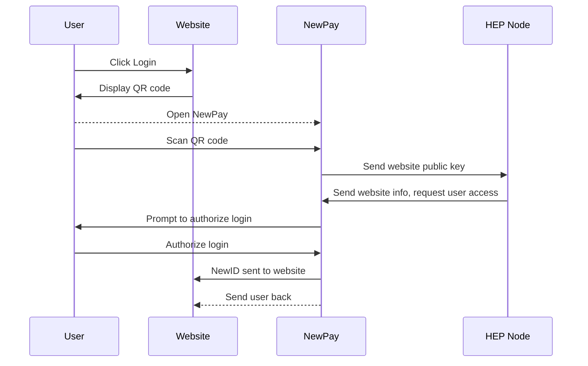
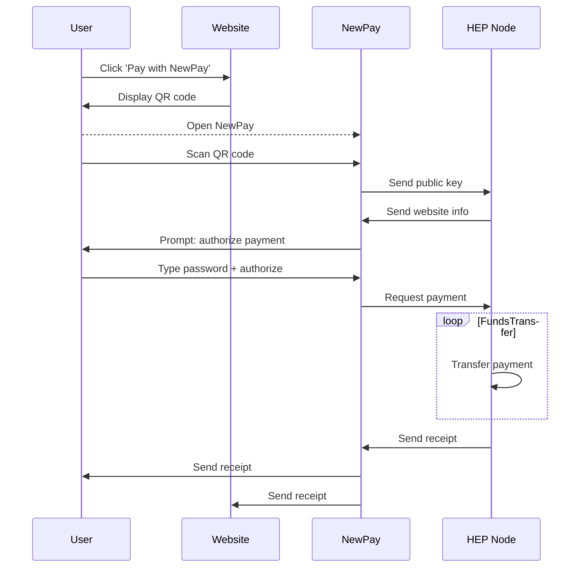

# Decentralized Web

The HEP SDK provides a Javascript API for websites to integrate with NewID for user login and payments

## User Account Creation and Login

### Preconditions

* User has NewPay installed on their device and has set a NewID
* The Dapp or website requesting login has [registered on Newton's platform]

### Website requests user login

1. Website displays *Login with NewID* button
2. User clicks or taps button
3. If on mobile, user is redirected to NewPay. Otherwise, website pops up a QR code for user to scan, containing [website signature] and [message]

* See [newpay.web.login.requestAccess]

### User authorizes website on NewPay

1. NewPay gets public key of website through [signature] and [message] parameters
2. NewPay sends public key to [HEP Node]
3. HEP Node uses public key to request website information that was registered in database and sends that information back to NewPay
4. NewPay opens and prompts user to authorize the website login based on information gathered from HEP Node
5. User confirms login
6. User's NewID is sent to website, with [message] and [signature]

## Payments

### Website requests user payment

1. Website displays *Pay with NewID* button
2. User clicks or taps button
3. If on mobile, user is redirected to NewPay. Otherwise, website pops up a QR code for user to scan, containing [order information], [website signature] and [message]

* See [newpay.web.payment.requestAccess]

### User authorizes payment on NewPay

1. NewPay gets public key of website through [signature] and [message] parameters
2. NewPay sends public key to [HEP Node]
3. HEP Node uses public key to request website information that was registered in database and order information, and sends that information back to NewPay
4. NewPay opens and prompts user to authorize the payment based on information gathered from HEP Node
5. User confirms payment
6. User's NewID is sent to website, with [message] and [signature]
7. Payment receipt is sent to user and website
7. User is redirected back to website
