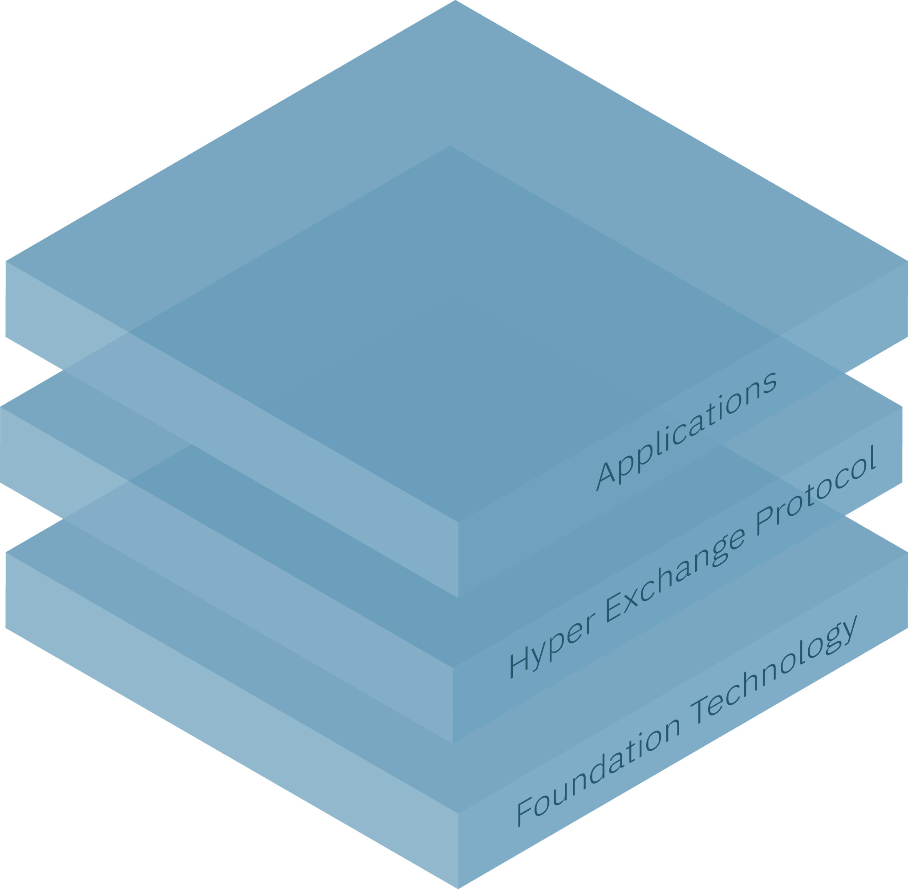
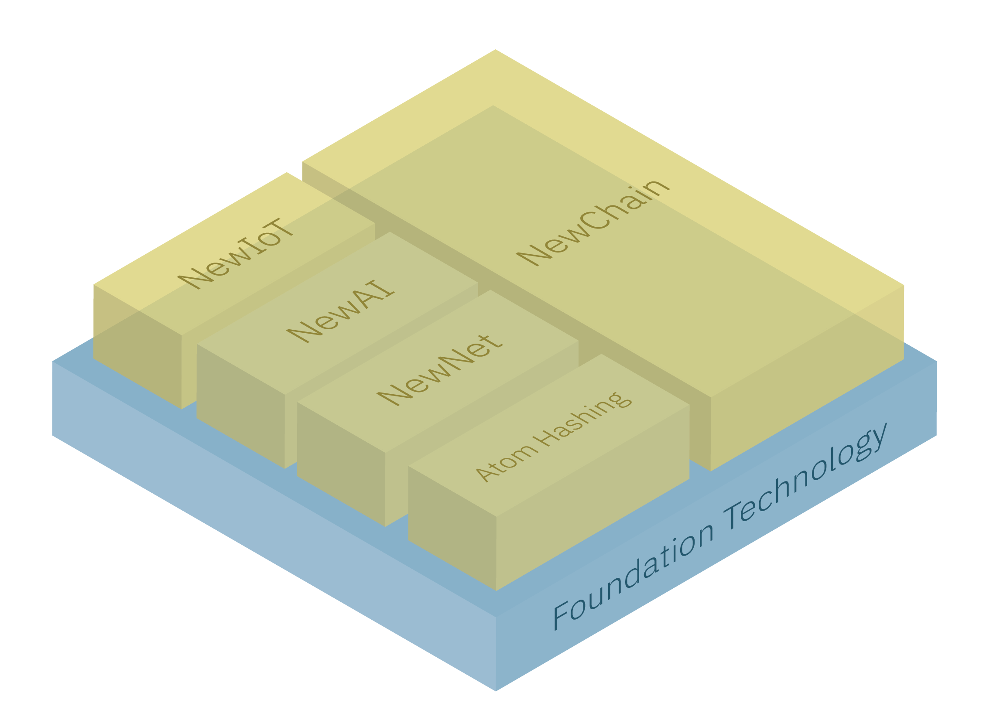
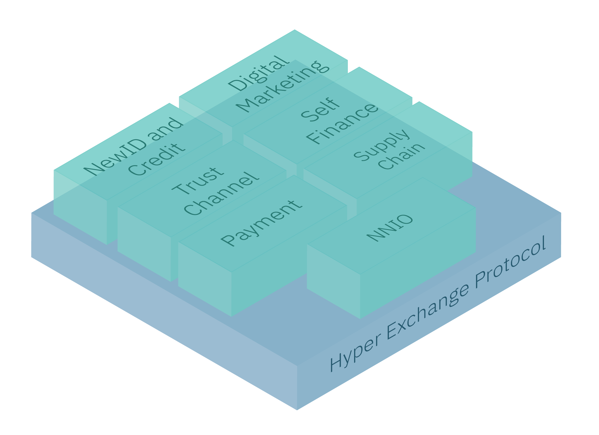
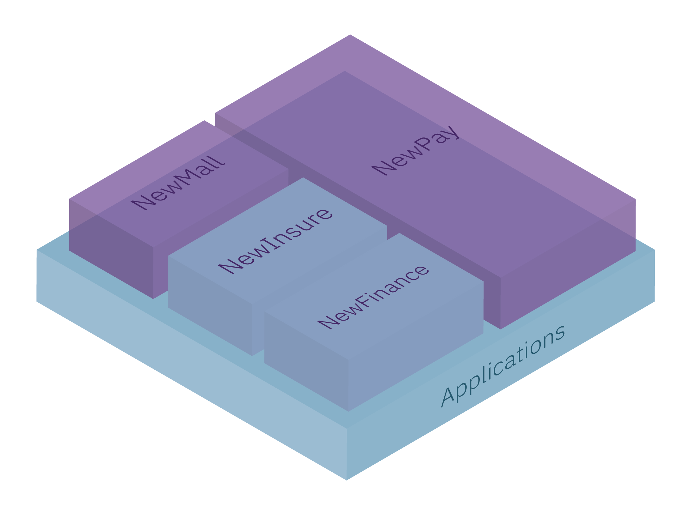

# Hyper Exchange Protocol 1.0

The Hyper Exchange Protocol (HEP for short) is the middle layer of Newton's tech stack, between the basic system and user-facing Dapps, and provides high-level libraries for developers.

Version 1.0 of our HEP SDK includes support for logging in with NewID, making payments, and getting proof of action.

# Behind the Scenes: Newton's Tech Stack

Newton has three layers in its stack:

* **Foundation Technology**: NewChain and other basic technologies that enable Newton's infrastructure.
* **Hyper Exchange Protocol**: Libraries that provide high-level functions to developers, so they don't have to dive into the nitty-gritty of the foundation technology.
* **Applications**: What the end-user sees. These are decentralized apps (*dapps*) like NewPay and NewMall. In the future we'll host a large range of dapps being built by third parties. These could include equivalents to Airbnb, Uber, Facebook, or some other killer app as yet undiscovered.

Let's look at them from the ground up:

## Foundation Technology

* NewChain: Newton's blockchain, consisting of a main chain and multiple sub-chains. Everything in the Newton ecosystem interacts with NewChain in some capacity.
* NewIoT: Devices and sensors on the Internet of Things. These devices can collect data and make transactions via smart contracts, and any high-priority data (e.g. a collection of temperature data from a shipping container of tea leaves) can be uploaded to NewChain's main chain.
* NewNet: Like cloud services, NewNet lets users outsource their computer storage and processing needs to other devices on the network. If you provide data storage or processing capacity, you get rewarded. Or if you need more storage or processing, you can pay in NEW and your data and processing will be distributed in tiny, encrypted chunks throughout the network.
* NewAI: Machine learning and artificial intelligence that uses NewNet for storage and processing, and writes high-priority results to NewChain's main chain.

## Hyper Exchange Protocol

### Payments

Rapid payments using NEW tokens, fiat currency, or other supported cryptocurrencies.

### Identity and Credit

We live in an age of data abuse, data theft, and data leaks. Yet many companies seem to ask for more and more of our personal information.

We want to fix that. Newton lets users register any number of NewIDs to log in to different services as they wish. Each NewID can have different information associated with it. For example, let's look at Alice:

| **NewID**             | **Connected information** | **Shared with**   |
| ---               | ---                   | ---           |
| **Alice's health ID** | Workout regime, steps per day, heartbeat, weight | Gym, fitness app, fitness tracker wristband |
| **Alice's social media ID** | Name, photos, favorite music, friend network | Social media, photo app, individual friends |
| **Alice's professional ID** | Name, professional photo, CV, testimonials, professional network |
| **Alice's BMI ID** | Body Mass Index. No name, no other info | Anonymous study by exercise company on weight loss |

Silo'ing information in different ID's prevents user profiling, radically reduces the chance of identity theft, and lets users control their own data or sell it to third parties (as in the case of Alice's BMI ID)

Each ID is protected with secure cryptography that only the user holds the key to. No one else, not even Newton, can access their data without explicit consent.

### Digital Marketing

Users can decide how many ads they wish to see instead of being bombarded like they are now, and they can be reimbursed by marketers for seeing the ads, taking surveys, etc. All customer data is anonymized for security.
 
### Supply Chain

You just bought some authentic Chinese Oolong tea from your local corner shop. But how can you be sure it's really authentic? How can *anyone* be sure, from the friendly shopkeeper you bought it from, to every agent in the supply chain?

We talked earlier about how each user in the Newton ecosystem has their own unique NewID. But it's not just for people. Any physical or digital good can be tagged with its own NewID, and then that ID and it's tracking information uploaded to the NewChain. You, and everyone who dealt with that tea, can track it from the fields of China to your corner store.

#### Atom Hashing

That's all well and good for tea. But what about high-end items like diamonds? In this case, Newton offers *Atom Hashing*, a merchant can scan every important property of an object and store it on NewChain. For a diamond this could be weight, clarity, color, and so on. Then they can ship it securely in a NewIoT enabled container, which can track position, tampering, and shocks. When it finally arrives at the buyer, they can use equipment to scan the diamond's properties themselves and compare it with the record on NewChain.

### Trust Channel

Newton's technology allows end-to-end security for the supply chain and other use cases. When dealing with sensitive materials, Party A can place the material in a secure NewBox safe and lock it using their NewID before shipping. If Party B is authorized by Party A, they can then unlock it with their NewID and the NewPay when it arrives. Tampering can be detected using our NewTag technology.

### Self Finance: Preset smart contracts for insurance, transactions, etc

With self-finance, users can choose from (and customize) Newton's library of pre-defined smart contracts to purchase insurance, financial investment services, etc.

### NNIO: NewNet Input/Output - distributed DNS

Traditional DNS connects IP addresses (like 47.75.9.111) to a domain name (like newtonproject.org). This makes using the internet a lot easier, but centralization comes at a price. At the beginning of the 21st century, the American government re-assigned the domain names of Afghanistan and Iraq. A hostile non-state actor could cause widespread chaos.

NNIO aims to provide a distributed DNS service for the decentralized internet. Instead of one node, there are many, distributed around the world. And instead of you having to connect to that DNS server located thousands of miles away, you can connect to your local peers, ensuring greater speed.

## Applications

* NewPay: "Super app" that lets users make transactions, manage their NewID digital identity, deal with credit, control their privacy setting, and access Newton's Dapp store
* NewMall: NewMall is Newton's first end-user application, and offers a similar experience to eBay, Amazon, or Alibaba, but with drastically lower fees for merchants, which can be passed on as savings to customers. Every participant, be they merchants, customers, or delivery staff, gets incentivized with NEW tokens, which they can later spend in NewMall or on other Newton services
* NewInsure and NewFinance: Example future apps
