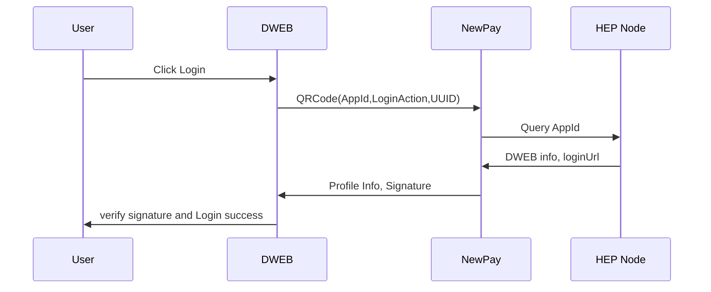
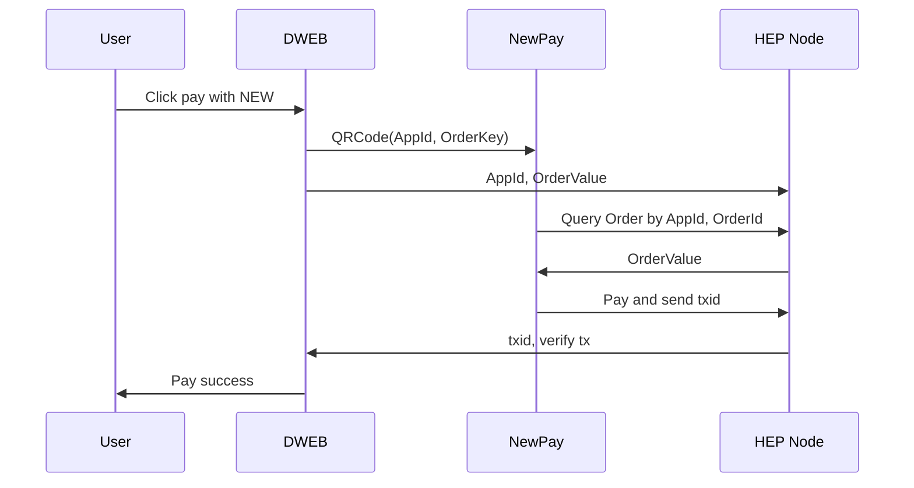
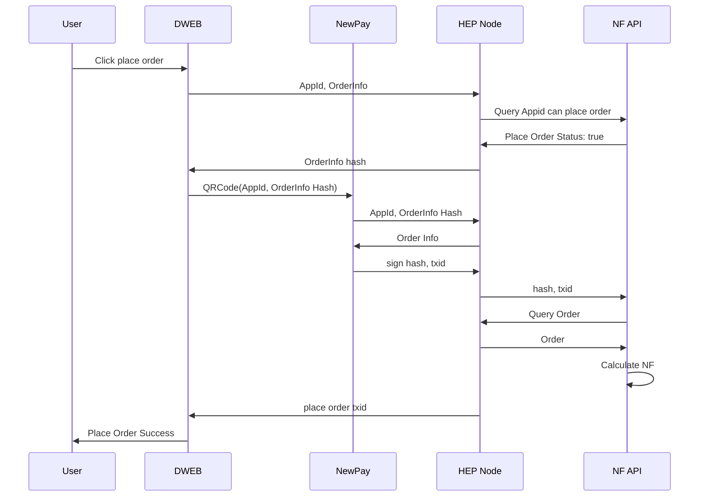

### 登录流程图

```mermaid
sequenceDiagram;
    participant User;
    participant DWEB;
	participant NewPay;
	participant HEP Node;
    User->>DWEB: Click Login;
    DWEB->>NewPay: QRCode(AppId,LoginAction,UUID)
    NewPay->>HEP Node:Query AppId
    HEP Node->> NewPay: DWEB info, loginUrl;
    NewPay->>DWEB:Profile Info, Signature;
    DWEB->>User:verify signature and Login success;
```

### 支付流程图

```mermaid
sequenceDiagram;
    participant User;
    participant DWEB;
	participant NewPay;
	participant HEP Node;
	User->>DWEB:Click pay with NEW;
	DWEB->>NewPay:QRCode(AppId, OrderKey);
	DWEB->>HEP Node:AppId, OrderValue;
	NewPay->>HEP Node:Query Order by AppId, OrderId;
	HEP Node->>NewPay: OrderValue;
	NewPay->>HEP Node:Pay and send txid;
	HEP Node->>DWEB:txid, verify tx;
	DWEB->>User:Pay success;
```

### 上链流程图

```mermaid
sequenceDiagram;
	participant User;
	participant DWEB;
	participant NewPay;
	participant HEP Node;
	participant NF API;
	User->>DWEB:Click place order;
	DWEB->>HEP Node:AppId, OrderInfo;
	HEP Node->>NF API:Query Appid can place order;
	NF API->>HEP Node:Place Order Status: true;
	HEP Node->>DWEB: OrderInfo hash;
	DWEB->>NewPay: QRCode(AppId, OrderInfo Hash)
	NewPay->> HEP Node:AppId, OrderInfo Hash;
	HEP Node->>NewPay:Order Info;
	NewPay->>HEP Node:sign hash, txid;
	HEP Node->>NF API:hash, txid;
	NF API->>HEP Node:Query Order;
	HEP Node->>NF API:Order;
	NF API->>NF API: Calculate NF;
	HEP Node->>DWEB:place order txid;
	DWEB->>User:Place Order Success;
```
