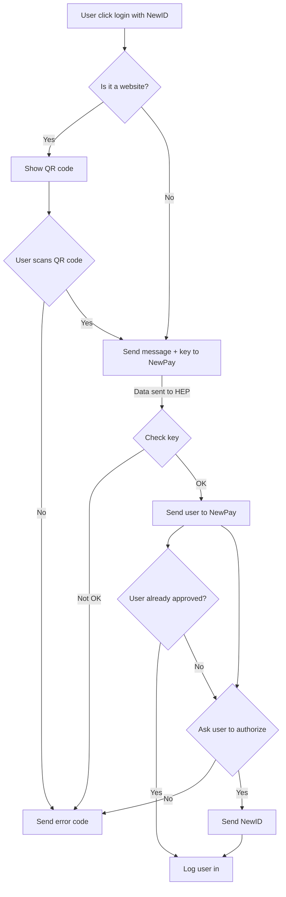

```mermaid
graph TD
Click[User click login with NewID] --> web_check{Is it a website?}
web_check--> |Yes| qr[Show QR code]
web_check--> |No| send_req_newpay
qr --> user_scan{User scans QR code}
user_scan-->|No| Err
user_scan-->|Yes| send_req_newpay
send_req_newpay[Send message + key to NewPay];
send_req_newpay --> |Data sent to HEP| check_key{Check key}
check_key -->|Not OK| Err[Send error code]
check_key -->|OK| redirect_newpay[Send user to NewPay]
redirect_newpay --> user_exist{User already approved?}
user_exist-->|Yes| login_user
user_exist-->|No| user_auth_ask{Ask user to authorize}
redirect_newpay --> user_auth_ask
user_auth_ask-->|No| Err
user_auth_ask-->|Yes| send_newid[Send NewID]
send_newid --> login_user[Log user in]
```
