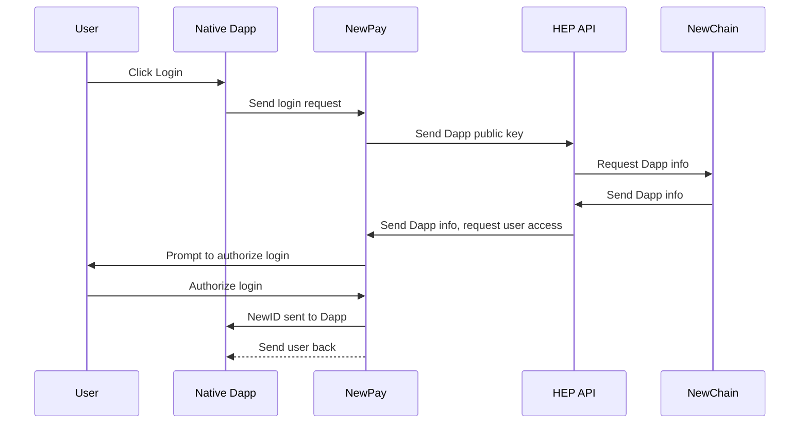
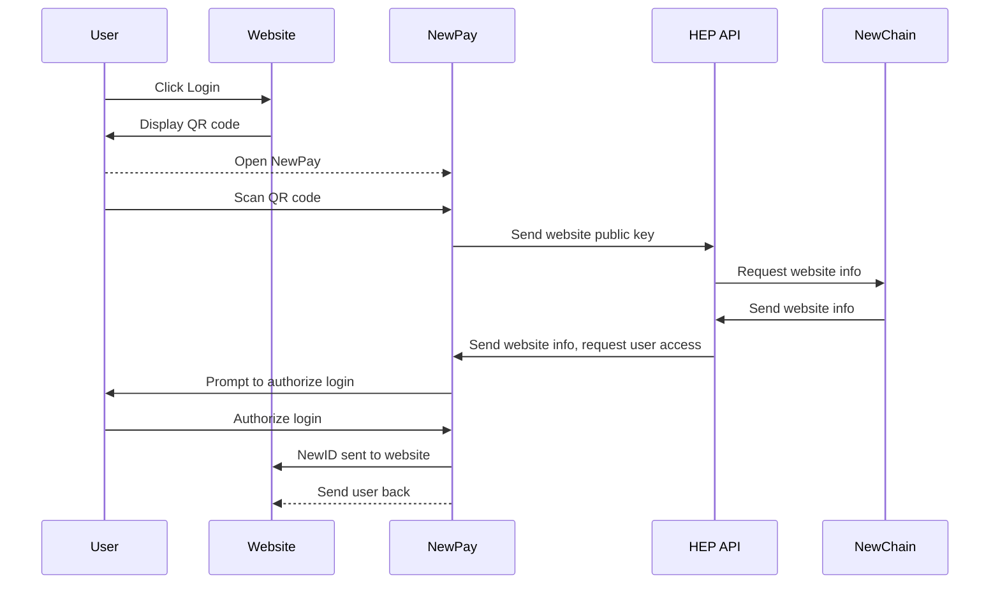
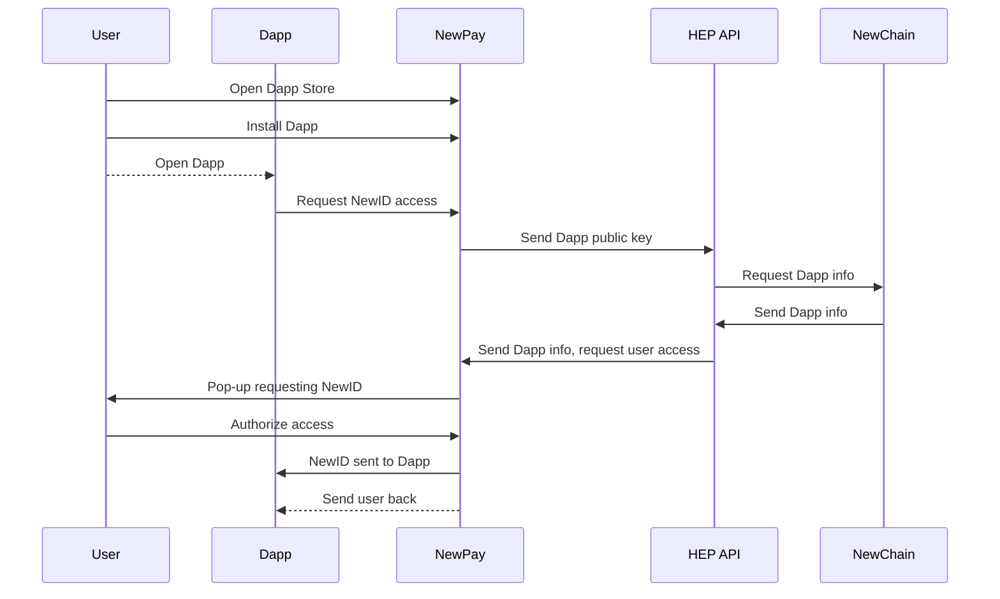

# NewPay Login Process

## Preconditions

* User has NewPay installed on their device and has set a NewID
* The Dapp or website requesting login has [registered on Newton's platform]

## The Login Process

## Native Dapp

### Dapp requests user login

1. Dapp displays **Login with NewID** button
2. User taps button

* See [newpay.native.login.requestAccess]

### User authorizes Dapp on NewPay

1. Dapp sends request for login to NewPay
2. NewPay gets public key of Dapp through [signature] and [message] parameters
3. NewPay sends public key to [HEP API]
4. HEP API uses public key to request app information that was registered in database and sends that information back to NewPay
5. NewPay opens and prompts user to authorize the Dapp login based on information gathered from HEP API
6. User confirms login
7. User's NewID is sent to Dapp, with [message] and [signature]

## Website

### Website requests user login

1. Website displays *Login with NewID* button
2. User clicks or taps button
3. If on mobile, user is redirected to NewPay. Otherwise, website pops up a QR code for user to scan, containing [website signature] and [message]

* See [newpay.web.login.requestAccess]

### User authorizes website on NewPay

1. NewPay gets public key of website through [signature] and [message] parameters
2. NewPay sends public key to [HEP API]
3. HEP API uses public key to request website information that was registered in database and sends that information back to NewPay
4. NewPay opens and prompts user to authorize the website login based on information gathered from HEP API
5. User confirms login
6. User's NewID is sent to website, with [message] and [signature]

## Dapp-in-Dapp

### User installs Dapp

1. User opens Dapp Store in NewPay
2. User installs Dapp
3. User's NewID automatically shared upon install (**correct**?)

### User opens Dapp in NewPay

* User automatically logged into in-app Dapp
