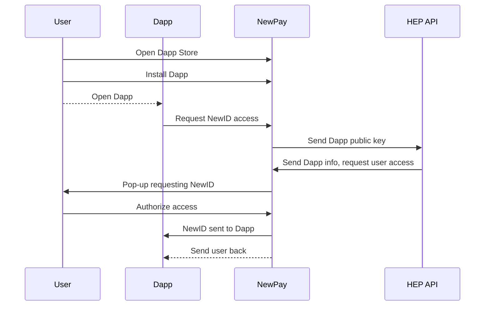
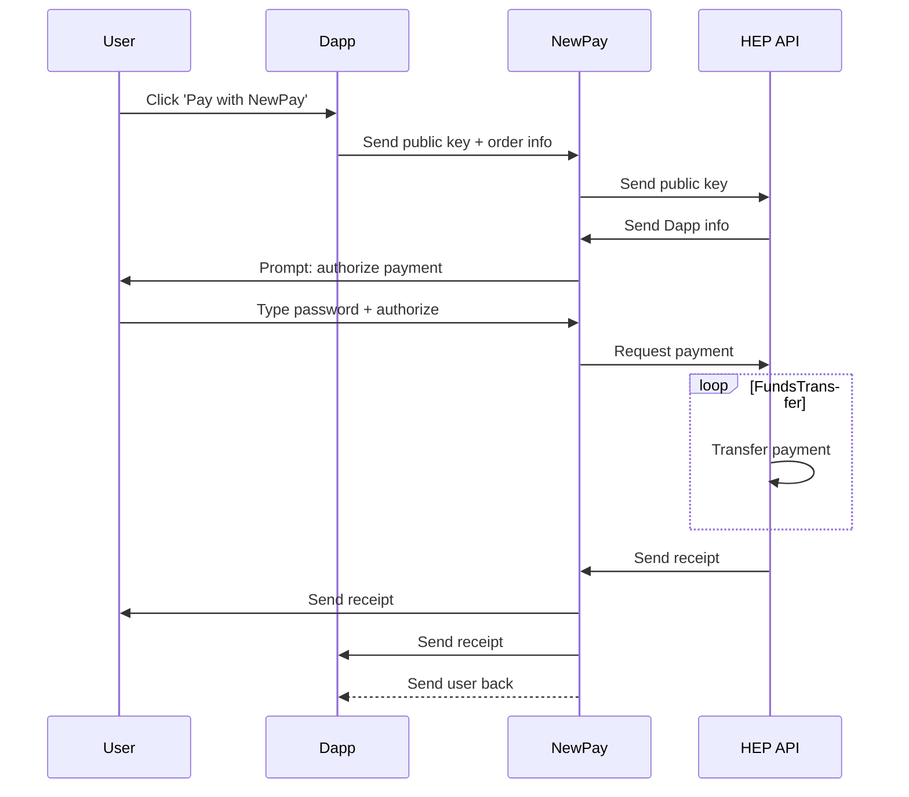

# Dapp-in-Dapp

Newton provides a Javascript API for Dapps-in-Dapps, which are mini-programs that run within the [NewPay Wallet] Dapp

## User Account Creation and Login

### Preconditions

* User has NewPay installed on their device and has set a NewID
* The Dapp or website requesting login has [registered on Newton's platform]

### User installs Dapp

1. User opens Dapp Store in NewPay
2. User installs Dapp
3. User's NewID automatically shared upon install (**correct**?)

### User opens Dapp in NewPay

* User automatically logged into Dapp-in-Dapp

## Payments

