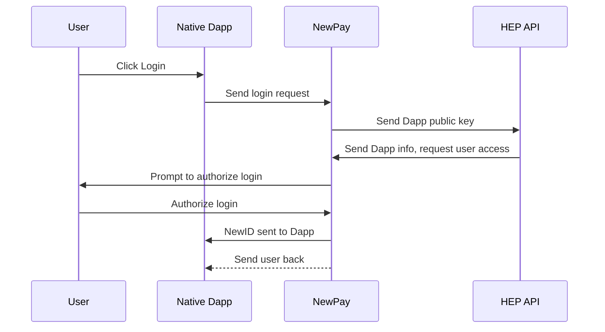
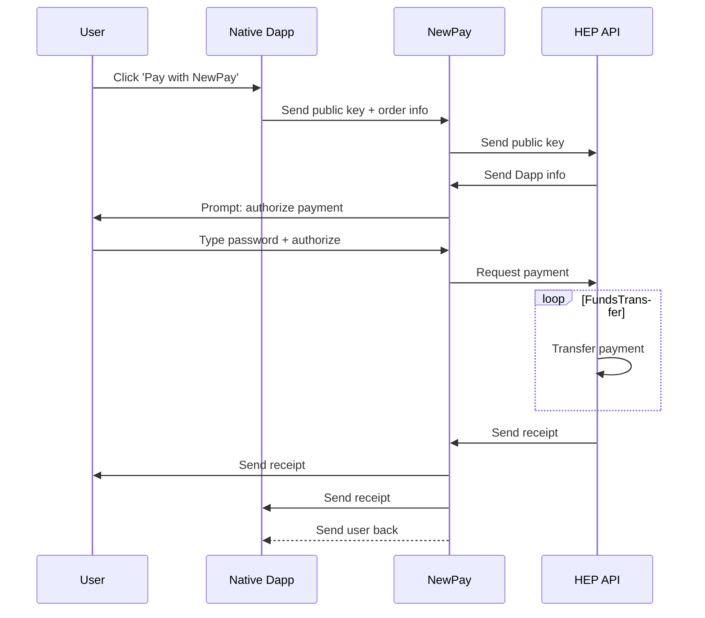

# Native Dapp

* Native Dapps are apps that users download from the Google Play Store or Apple App Store that integrate with NewPay. ([See all Dapp types](/))
* Android native Dapps use [Newton's Android NewPay SDK](https://github.com/newtonproject/NewPaySDK-Android)
* iOS native Dapps use [Newton's iOS NewPay SDK](/)

## User Account Creation and Login

### Preconditions

* User has NewPay installed on their device and has set a [NewID](/)
* The Dapp requesting login has [registered on Newton's platform](/)

### Dapp requests user login

1. Dapp displays **Login with NewID** button
2. User taps button

* See [newpay.native.login.requestAccess]

### User authorizes Dapp on NewPay

1. Dapp sends request for login to NewPay
2. NewPay gets public key of Dapp through [signature] and [message] parameters
3. NewPay sends public key to [HEP API]
4. HEP API uses public key to request app information that was registered in database and sends that information back to NewPay
5. NewPay opens and prompts user to authorize the Dapp login based on information gathered from HEP API
6. User confirms login
7. User's NewID is sent to Dapp, with [message] and [signature]

## Payments

### Dapp requests user payment

1. Dapp displays **Pay with NewID** button
2. User taps button

* See [newpay.native.payment.requestPayment]

### User authorizes payment on NewPay

1. NewPay gets public key of Dapp and order information through [signature] and [message] parameters
2. NewPay sends public key to [HEP API]
3. HEP API uses public key to request app information that was registered in database and sends that information back to NewPay
4. NewPay opens and prompts user to authorize the payment based on information gathered from HEP API
5. User confirms payment
6. Payment receipt is sent to user and Dapp
7. User is redirected back to Dapp

## Proof of Action
