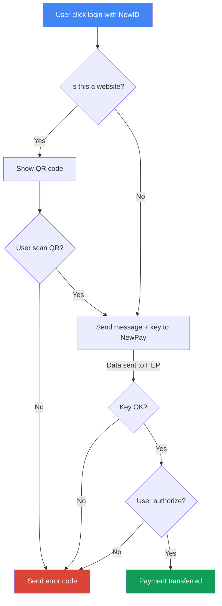

```mermaid
graph TD
start[User click login with NewID] --> web_check{Is this a website?}
web_check--> |Yes| qr[Show QR code]
web_check--> |No| send_req_newpay
qr --> user_scan{User scan QR?}
user_scan-->|No| Err
user_scan-->|Yes| send_req_newpay
send_req_newpay[Send message + key to NewPay];
send_req_newpay --> |Data sent to HEP| check_key{Key OK?}
check_key -->|No| Err[Send error code]
check_key -->|Yes| user_auth_ask{User authorize?}
user_auth_ask-->|No| Err
user_auth_ask-->|Yes| payment_ok[Payment transferred]

classDef blue fill:#4285F4, color: #fff;
classDef red fill:#DB4437, color: #fff;
classDef green fill:#0F9D58, color: #fff;
class Err red;
class payment_ok green;
class start blue;
```
