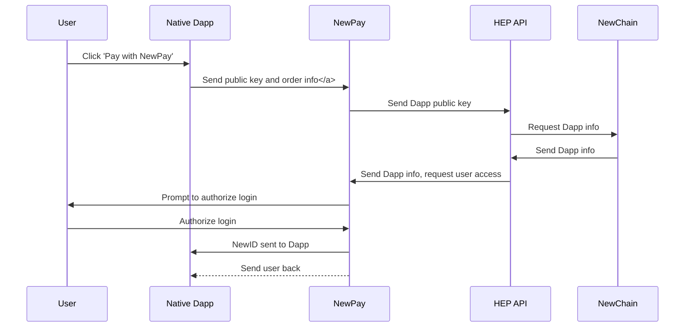

# NewPay Payment Process

## Preconditions

* User has NewPay installed on their device and has set a NewID
* The Dapp or website requesting payment has [registered on Newton's platform](register_service.md)
* User is already logged in to native dapp/website/dapp-in-dapp with their NewID

## The Payment Process

## Native Dapp

### Dapp requests user payment

1. Dapp displays **Pay with NewID** button
2. User taps button

* See [newpay.native.payment.requestPayment]

### User authorizes payment on NewPay

1. NewPay gets public key of Dapp and order information through [signature] and [message] parameters
2. NewPay sends public key to [HEP API]
3. HEP API uses public key to request app information that was registered in database and sends that information back to NewPay
4. NewPay opens and prompts user to authorize the payment based on information gathered from HEP API
5. User confirms payment
6. Payment receipt is sent to user and Dapp
7. User is redirected back to Dapp

## Website

### Website requests user payment

1. Website displays *Pay with NewID* button
2. User clicks or taps button
3. If on mobile, user is redirected to NewPay. Otherwise, website pops up a QR code for user to scan, containing [order information], [website signature] and [message]

* See [newpay.web.payment.requestAccess]

### User authorizes payment on NewPay

1. NewPay gets public key of website through [signature] and [message] parameters
2. NewPay sends public key to [HEP API]
3. HEP API uses public key to request website information that was registered in database and order information, and sends that information back to NewPay
4. NewPay opens and prompts user to authorize the payment based on information gathered from HEP API
5. User confirms payment
6. User's NewID is sent to website, with [message] and [signature]
7. Payment receipt is sent to user and website
7. User is redirected back to website

## Dapp-in-Dapp
