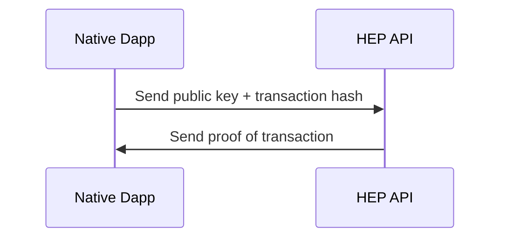
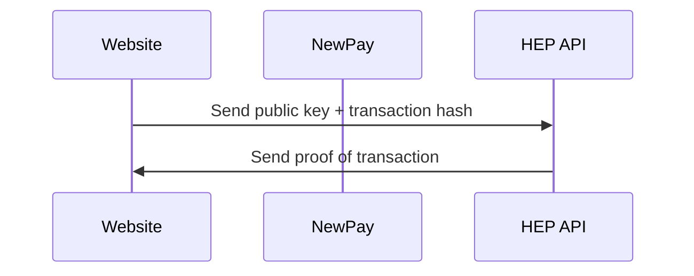
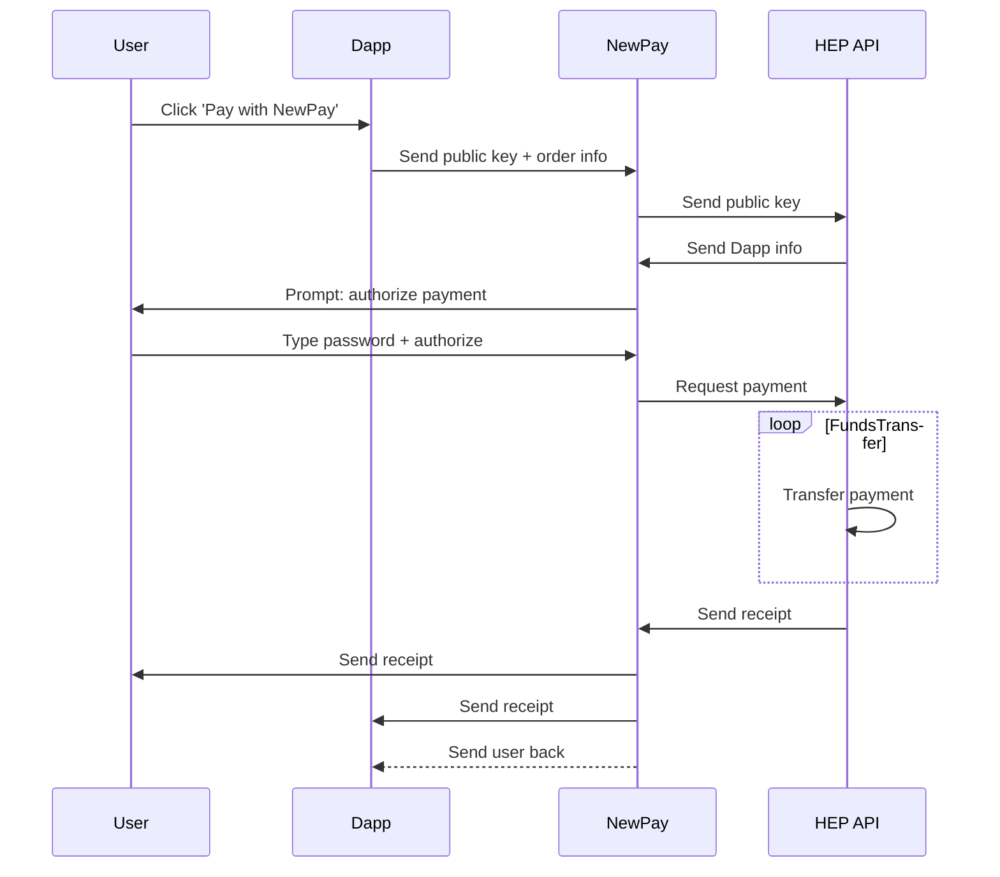

# NewPay Proof of Action Process

**Note:** 'Transaction' can refer to any action stored on NewChain, for example login, payment, etc

## Preconditions

* The Dapp or website requesting proof has [registered on Newton's platform](register_service.md)

## Native Dapp

## Website

## Dapp-in-Dapp

